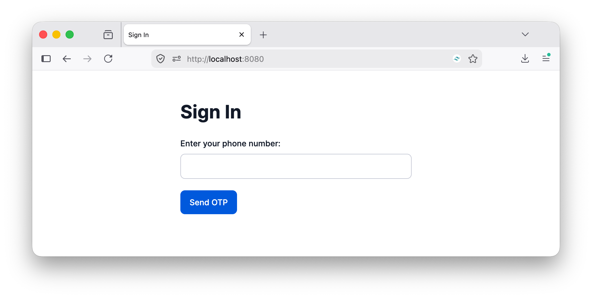
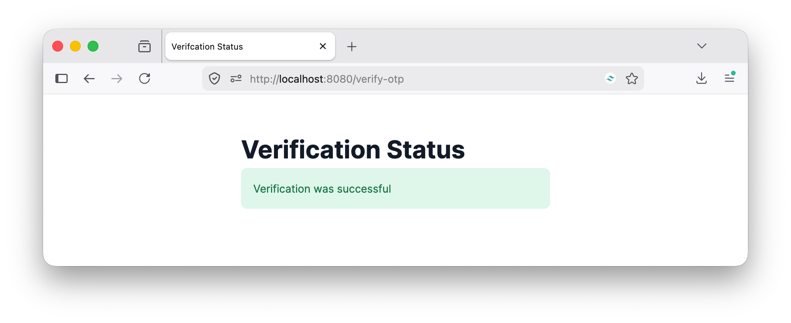

= Passwordless Authentication With Twilio Verify in PHP
:composer: https://getcomposer.org
:experimental: true
:license: http://www.opensource.org/licenses/mit-license.html
:php: https://php.net
:repo: https://github.com/settermjd/twilio-verify-passwordless-authentication-go

This project demonstrates how to implement passwordless authentication via OTP in PHP using Twilio Verify.

== Prerequisites

To run the app locally, you need the following:

* {php}[PHP] 8.4 or above
* {composer}[Composer] installed globally
* Your preferred code editor or IDE
* Some terminal experience is helpful, though not required

== Quickstart

=== Core setup

To set up the project: 

* Clone it locally
* Change into the project directory
* Install the project's dependencies with Composer

=== Set the required environment variables

Here is a list of the environment variables that need to be set in _.env_, along with what they're for:

[cols="15h,~,~",stripes=none]
.Required environment variables
|===
| Variable
| Format
| Where to find

| `TWILIO_ACCOUNT_SID`
| Starts with `AC`.
.2+| A {twilio-account-sid}[Twilio Account SID] can be found on {twilio-console}[the Twilio Console] dashboard under *Account Info*.

| `TWILIO_AUTH_TOKEN`
| 32-char string.
Treat it as a password.

| `TWILIO_VERIFY_SERVICE_SID`
| 32-char string.
Starts with `VA`.
| The Twilio Console → Verify → Services.
Find out more detail {twilio-verify-docs}[in the documentation].
|===

=== Start the application

Finally, start the application running locally.

[source,bash]
----
composer serve
----

The application will start on port 8080.

Open http://localhost:8080 in your browser of choice, enter your phone number in the form, in {e164-format}[E.164 format], and submit it.

You'll be redirected to the OTP verification form, and receive an SMS with a 6-digit OTP code via SMS.
Enter the code into the form and submit it.

image::docs/images/php-app/verify-otp-code-form.png[The verify OTP code form of the application]

If the verification was success, you'll see that confirmed.

Then, if you look in the terminal session or tab where you started the application, you'll see a log entry similar to the following:

[source,bash]
----
2026/07/16 10:50:00 Verification successful
----

== Contributing

If you want to contribute to the project, whether you have found issues with it or just want to improve it, here's how:

* {repo}/issues[Issues]: ask questions and submit your feature requests, bug reports, etc
* {repo}/pulls[Pull requests]: send your improvements

== License

{license}[MIT]

== Disclaimer

No warranty expressed or implied.
Software is as is.
