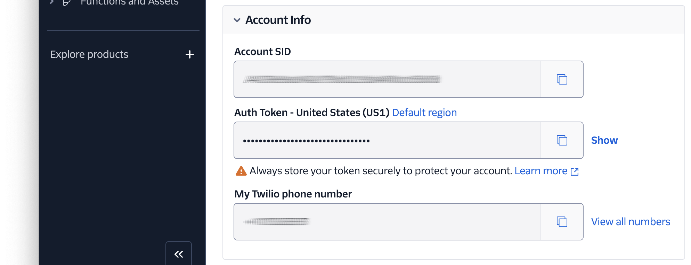

<!-- markdownlint-disable MD013 -->

# Twilio / Slim Base Project

This is a small, almost skeleton project that I base my PHP projects on which underpin [my Twilio tutorials][twilio-tutorials].
It's not intended to be special, nor feature-rich.
Rather, it's designed to save me time getting started building my next PHP project for an upcoming Twilio tutorial.

It:

- Is a small, web-based PHP application based on [the Slim Framework][slim-framework]
- Has one route which returns no body and a minimum of HTTP headers
- Wraps Slim's `Application` object in a small utility class to make writing maintainable code easier

> [!note]
> The project does not make presumptions about the kind of application which will be built with it, thereby leaning toward a more ad hoc approach.
> However, it still tries to provide a sense of structure, for when that may be necessary, by including three empty directories: _Entities_, _Services_, and _Middleware_ in the _src_ directory.
> These are to provide a clear sense of structure as and when an application is built that would make use of these types of classes.

## Prerequisites

You'll need the following to use the application:

- PHP 8.4 or above
- [Composer][composer] installed globally
- Your preferred code editor or IDE
- Some terminal experience is helpful, though not required

## Quick Start

To create a new project from this project, wherever you store your PHP apps, run the following command:

```bash
composer create-project settermjd/twilio-slim-base-project <my-project>
```

> [!TIP]
> Replace `<my-project>` with whatever you want to name the new project directory.

Then, open [the Twilio Console][twilio-console] in your browser of choice, and copy the **Account SID**, **Auth Token**, and **phone number** from the **Account Info**, as you can see in the screenshot below.



Then, set those values as the values of `TWILIO_ACCOUNT_SID`, `TWILIO_AUTH_TOKEN`, and `TWILIO_PHONE_NUMBER`, respectively, in _.env_.

### Configuring the application

Once the project has been bootstrapped, if you want to use the Twilio Rest Client registered with the container, uncomment the first element of the array passed to initialise the `RequiredEnvironmentVariables` object, which is passed to `$dotenv->required()` in _public/index.php_.

For example:

```php
$dotenv->required(
    new RequiredEnvironmentVariables([
        App\Config\RequiredEnvironmentVariables\Spec\TwilioRestClient::class,
        // App\Config\RequiredEnvironmentVariables\Spec\TwilioPhoneNumber::class,
    ])->getEnvVars(),
)->notEmpty();
```

## Contributing

If you want to contribute to the project, whether you have found issues with it or just want to improve it, here's how:

- [Issues][github-issues]: ask questions and submit your feature requests, bug reports, etc
- [Pull requests][github-prs]: send your improvements

## License

[MIT][mit-license]

## Disclaimer

No warranty expressed or implied. Software is as is.

<!-- Links -->

[composer]: https://getcomposer.org
[github-issues]: https://github.com/settermjd/twilio-slim-base-project/issues
[github-prs]: https://github.com/settermjd/twilio-slim-base-project/pulls
[mit-license]: http://www.opensource.org/licenses/mit-license.html
[slim-framework]: https://www.slimframework.com
[twilio-console]: https://console.twilio.com
[twilio-tutorials]: https://www.twilio.com/en-us/blog/authors/author.msetter

<!-- markdownlint-enable MD013 -->
